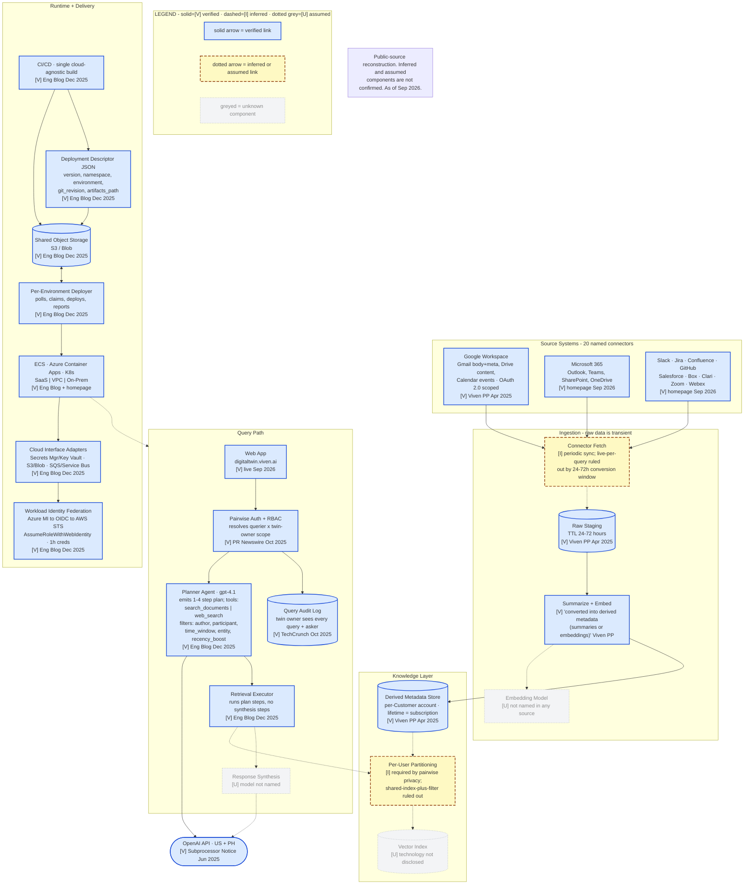
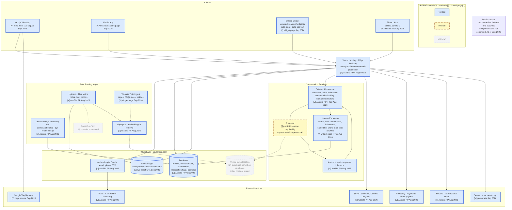
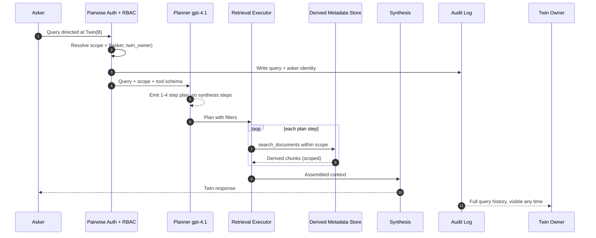
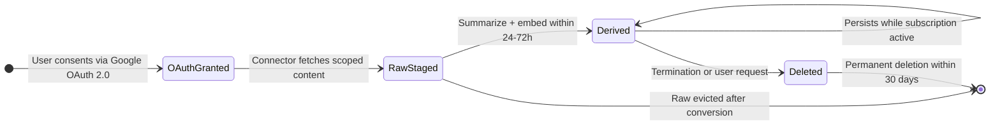

# Viven Architecture Deep-Dive — Claude Code Build Brief

**Target repo:** `vivekally.github.io/digital-twins`
**Research conducted:** 11 Sep 2026
**Purpose:** add a verified architecture deep-dive, and correct three claims on the existing slide 03.

---

## 0. How to use this file

This is a research handoff, not a spec to implement literally. Sections 1 and 2 are the build
instructions. Sections 3 to 6 are the evidence base. Section 7 is the source registry.

Every technical claim carries an evidence tag:

- `[V]` verified against a primary source, with the source and date named
- `[I]` inferred, with the reasoning and the ruled-out alternative both stated
- `[U]` unknown, deliberately not filled

Hard rule carried over from the research pass: **model names, vector store, orchestration
framework, infra provider, and context or memory design are `[V]` or `[U]` only, never `[I]`.**
Do not let a plausible default get promoted into the page.

---

## 1. Build brief

### 1.1 What to build

A new section, `07 Architecture verified`, positioned immediately after the existing `03 Architecture`
slide, or as a linked sub-page off slide 03. Recommendation: sub-page. Slide 03 is a
three-vendor comparison and works as-is; this material is single-vendor depth and would
unbalance the deck if inlined.

Working title options, matched to the existing headline voice:

- "Viven published an engineering blog. *Most of slide 03 needs updating.*"
- "The architecture is no longer *claimed*."
- "Two products. *Zero shared vendors.*"

The third is the strongest finding and the least expected.

### 1.2 Site conventions to preserve

Read from the live site on 11 Sep 2026. Match these, do not invent new patterns:

- Numbered section header, format: `NN Section name` + right-aligned date or scope qualifier
- Headline with one italicised emphasis phrase
- Standfirst paragraph with one **bolded** load-bearing sentence
- Layer stacks rendered `L7` down to `L1`, each with a name, a dek, and a body
- `The finding` / `The consequence` closing pair
- A `Caveat:` or `Confidence:` block at the foot of every section, in smaller type
- Keyboard nav: `←` `→` between sections, `S` opens the sources modal
- Sources modal entries numbered continuously; this section starts at **44**
- Footer: `← → to navigate · S for sources`

### 1.3 Authoring constraints

- No em dashes anywhere. Use commas, "and", or restructure. En dashes are fine in numeric ranges.
- Token-efficient prose. Bullets over paragraphs. Tables only for three or more compared items.
- Do not introduce a dark theme, a colour-coded scheme, or external dependencies unless the
  existing stylesheet already has them. Match what is there.
- Every diagram must visually encode confidence, not just caption it. See section 5.

### 1.4 Suggested section flow

1. **Lede:** the Dec 2025 engineering blog posts exist, so slide 03's "no engineering blog" caveat
   is now wrong and L4 is partly verified.
2. **The split:** Viven Enterprise and AskSila run on disjoint vendor stacks. Table.
3. **Layer stack, re-graded:** reuse the L1 to L7 visual from slide 03, but re-tag each layer
   `[V]` / `[I]` / `[U]` against the new evidence.
4. **Diagrams:** two system diagrams plus the sequence and lifecycle diagrams.
5. **What would move each `[U]`:** the promotion table. This is the most useful artefact for a
   reader tracking the company.
6. **Caveat block.**

---

## 2. Corrections to the existing slide 03

These are not additions. They contradict what is published now.

| # | Slide 03 currently says | Status | Replace with |
|---|---|---|---|
| C1 | "Viven has published no engineering blog, whitepaper or patent" | **False as of Dec 2025** | Two engineering posts published Dec 2025: *Supervised Prompt Optimization* (10 Dec) and *Single Artifact, Multi-Cloud Deployments* (22 Dec). Patents: still none found. |
| C2 | "Treat L4 for Viven as claimed architecture, not verified architecture" | **Partly superseded** | The L4 retrieval design is now verified from a primary engineering source. The *pairwise authorization mechanism specifically* remains claimed, sourced only to founder interviews and the launch release. Split the caveat in two. |
| C3 | "Viven's model is undisclosed" | **Partly superseded** | Enterprise planner runs `gpt-4.1` in production `[V]`. Offline prompt optimization uses `gpt-5` at medium reasoning `[V]`. OpenAI is the named enterprise LLM subprocessor `[V]`. AskSila uses Anthropic for inference and Voyage AI for embeddings `[V]`. The enterprise *synthesis* model remains `[U]`. |
| C4 | Slide 03 and slide 02 cover Viven as a single enterprise product | **Incomplete** | Viven operates a second product, AskSila, with a public expert directory, payments, a mobile app, an embeddable widget, and a completely separate vendor stack. It is absent from the deck. |
| C5 | "Viven ships none of it [embodiment]: text only, deliberately" | **Nuance, not error** | Still true for *output*. AskSila accepts voice note *input* and ships a mobile app, so the input path is multimodal. Keep the claim, add the qualifier. |

**Do not silently edit slide 03.** The site's own convention is publish-then-extend. Recommended
handling: leave slide 03 intact, add a short inline "Updated Sep 2026, see section 07" marker on
the affected caveat, and carry the full correction in the new section.

---

## 3. Finding 1: two products, disjoint stacks

### 3.1 The determination

The question is whether Viven runs one backend with different packaging, or two genuinely
separate systems. Answer: **(b) genuinely separate systems**, on the current evidence.

Two independently published subprocessor disclosures share **zero vendors**.

| Layer | Viven Enterprise | AskSila |
|---|---|---|
| Compute and hosting | AWS and Azure, customer-side deployer `[V]` Eng Blog, Dec 2025 | Vercel `[V]` AskSila PP, Aug 2026 |
| Database, auth, storage | not publicly disclosed `[U]` | Supabase `[V]` AskSila PP, Aug 2026 |
| LLM inference | OpenAI `[V]` Subprocessor Notice, Jun 2025 | Anthropic `[V]` AskSila PP, Aug 2026 |
| Embeddings | not disclosed `[U]` | Voyage AI `[V]` AskSila PP, Aug 2026 |
| Payments | none, contract Orders `[V]` ToS, Jun 2025 | Stripe and Razorpay `[V]` AskSila PP, Aug 2026 |
| SMS | none | Twilio `[V]` AskSila PP, Aug 2026 |
| Transactional email | not disclosed `[U]` | Resend `[V]` AskSila PP, Aug 2026 |
| Error monitoring | not disclosed `[U]` | Sentry `[V]` page meta, Sep 2026 |
| Runtime | ECS, Azure Container Apps, Kubernetes `[V]` Eng Blog | Next.js serverless `[V]` page meta, Sep 2026 |
| Deployment options | SaaS, VPC, on-prem `[V]` homepage | SaaS only `[V]` AskSila PP |

### 3.2 Corroborating artefacts

Beyond the two vendor lists, three live DOM artefacts confirm the AskSila side independently:

- A production asset served from `api.asksila.com/storage/v1/object/public/avatars/...`, which is
  the Supabase Storage path signature on a custom domain `[V]` asksila.com page source, Sep 2026
- `sentry-environment=vercel-production` in every page `<head>` `[V]` Sep 2026
- `meta-next-size-adjust` present, indicating Next.js `[V]` Sep 2026

### 3.3 The honest caveat, which must appear on the page

The Viven enterprise subprocessor notice is dated **June 2025** and may be stale. The AskSila
policy is dated **August 2026**. If the enterprise notice were refreshed and named Anthropic,
Voyage, or Vercel, this determination could move back toward a single shared backend. The
finding rests on a 14-month gap between two documents.

Separately: the Viven homepage says AskSila is "Built on Viven." That is marketing copy and is
excluded as a technical source under the research policy used here. What is evidenced as shared
is the legal entity, WisdomLabs.AI, Inc., and the product concept. Not the runtime.

---

## 4. Layer stack, re-graded

Reuse the slide 03 `L7` to `L1` visual. New grades:

**L7 Governance** `[V]`
RBAC, full per-twin query audit visible to the twin owner, admin-level and individual-level
privacy controls, SaaS / VPC / on-prem. Encryption TLS 1.2+ and AES-256.
Sources: PR Newswire Oct 2025; Inc. Oct 2025; Viven Privacy Policy Apr 2025.

**L6 Embodiment** `[V]` for absence of output embodiment
Enterprise is text only. AskSila adds voice note input, a mobile app, and an embeddable web
widget. No voice or video *output* found on either product.
Sources: viven.ai homepage; asksila.com Sep 2026.

**L5 Generation** — mixed
Enterprise planner `gpt-4.1` in production `[V]`. Offline prompt optimization `gpt-5` medium
reasoning `[V]`. Enterprise synthesis model `[U]`. AskSila inference: Anthropic `[V]`.
Source: Viven Engineering Blog, 10 Dec 2025; AskSila Privacy Policy, 28 Aug 2026.

**L4 Retrieval and authorization** — now split
*Retrieval design is verified.* The planner emits a 1 to 4 step plan using exactly two tools,
`search_documents` (internal) and `web_search` (public), with structured filters: `author`,
`participant`, `time_window`, `entity/topic`, `event_date`, `recency_boost`. The planner is
explicitly forbidden from emitting synthesis steps; the executor synthesises. `[V]` Eng Blog,
10 Dec 2025.
*Authorization mechanism remains claimed.* "Pairwise context and privacy" is still sourced only
to founder interviews and the launch release. `[U]` for mechanism.

**L3 Person model** `[U]` for enterprise
No primary source describes a temporal knowledge graph on the enterprise side. One corroborating
signal exists on the consumer side: an AskSila marketing excerpt referencing export of "your
knowledge graph ... in standard formats." **Provenance caveat:** that sentence appeared in a
cached search excerpt of asksila.com and was not present in the direct page fetch on 11 Sep 2026.
Treat as unconfirmed. Do not use it to grade the enterprise L3.

**L2 Ingest and normalize** `[V]`, and stronger than slide 03 assumes
Raw source content is converted into derived metadata, specifically summaries or embeddings,
**within 24 to 72 hours**, after which the raw payload is not retained. Derived metadata persists
for the life of the subscription. Full deletion within 30 days of termination or request.
Source: Viven Privacy Policy, 1 Apr 2025. This is a materially harder constraint than a normal
RAG pipeline and is the single most architecturally distinctive verified fact about the company.

**L1 Sources** `[V]`
Enterprise: 20 named connectors. Google Workspace access is scoped to Gmail subject, sender,
recipients, timestamps and body; Drive file names, content and metadata; Calendar titles, times,
participants and links. Plus Box, Clari, Confluence, GitHub, Jira, OneDrive, Outlook, Salesforce
Case and Deal, SharePoint, Slack, Teams, Webex, Zoom.
AskSila: file upload, voice notes, text, LinkedIn Page Portability API (1-year retention cap),
and website / FAQ / documentation crawl for the Website Twin.
Sources: viven.ai homepage Sep 2026; Viven Privacy Policy Apr 2025; AskSila Privacy Policy Aug 2026.

---

## 5. Diagrams

Four diagrams follow. Mermaid source is given so the build can either render it directly or
port it to the site's existing visual language.

**Confidence encoding is mandatory and must be visual, not captioned:**

- solid border, solid arrow = `[V]` verified
- dashed border, dashed arrow = `[I]` inferred
- dotted border, greyed fill = `[U]` assumed from the reference pattern

A legend node must sit inside each diagram. A title block must read:
`Public-source reconstruction. Inferred and assumed components are not confirmed. As of Sep 2026.`

Note on Mermaid: it offers solid (`-->`) and dotted (`-.->`) link styles but no third distinct
dashed style, so `[I]` and `[U]` links share the dotted form and the **node styling is the
discriminator**. If porting to hand-built SVG, give `[I]` and `[U]` genuinely distinct strokes.

**Do not draw a component solely because the reference pattern usually has one.** An honest
diagram with six boxes beats a complete one with twenty.

### 5.1 Viven Enterprise

### 5.2 AskSila

### 5.3 Enterprise query sequence

All participants `[V]`. The two dotted returns are `[I]`.

**Editorial note for the page:** the ordering matters more than the components. Scope resolution
and the audit write both happen *before* plan generation. That sequencing is what the pairwise
claim structurally requires, and it is the load-bearing constraint in the whole system. If the
page makes one architectural argument, make it this one.

### 5.4 Enterprise data lifecycle

Every transition is `[V]` from the Viven Privacy Policy, effective 1 Apr 2025.

---

## 6. What would move each `[U]`

This table is the most reusable artefact here. It converts the gaps into a watchlist.

| Unknown | Single source that would promote it to `[V]` |
|---|---|
| Enterprise vector store technology | An engineering blog post or job posting naming the index technology |
| Enterprise embedding model | An updated Viven subprocessor notice, or an ingestion-pipeline blog post |
| Enterprise synthesis model | An engineering post covering the generation stage, as Dec 2025 covered planning |
| AskSila vector index location | An AskSila engineering post naming pgvector, or a new index vendor in the subprocessor list |
| AskSila speech-to-text provider | Addition of the transcription vendor to the AskSila subprocessor list |
| Orchestration framework | Any engineering post or job posting naming it |
| Pairwise authorization mechanism | A security whitepaper or engineering post describing enforcement at retrieval time |
| Per-user data isolation model | A security whitepaper describing physical or logical partitioning per twin |
| SOC 2 / ISO 27001 status | A trust center or a published attestation |
| Rate limits, latency SLOs, pricing meters | Public API docs or a published pricing page |
| Whether the two products share code | Either subprocessor list converging on the other's vendors |

**Searched and not found**, worth stating on the page so readers do not repeat the work: public
GitHub org, developer or API documentation, status page, incident history, SOC 2 or trust center,
patents assigned to WisdomLabs.AI, changelog, integration marketplace listings, conference talks.

---

## 7. Source registry

Continue the site's numbering from **44**. Retrieved 11 Sep 2026 unless noted.

| # | Source | Type | Date | Used for |
|---|---|---|---|---|
| 44 | `asksila.com/legal/privacy-policy` | Legal, full subprocessor list | 28 Aug 2026 | The entire AskSila vendor stack |
| 45 | `asksila.com/legal/terms-of-service` | Legal | 28 Aug 2026 | Moderation, escalation, discovery, payments, age floor |
| 46 | `viven.ai/blog/supervised-prompt-optimization` | Engineering blog | 10 Dec 2025 | Planner/executor split, tool schema, filters, gpt-4.1, gpt-5, GEPA method |
| 47 | `viven.ai/blog/single-artifact-multi-cloud-deployments` | Engineering blog | 22 Dec 2025 | CI/CD, deployment descriptor, deployer, cloud adapters, OIDC federation |
| 48 | `viven.ai/legal/privacy-policy` | Legal | 1 Apr 2025 | 24-72h conversion, 30-day deletion, OAuth scopes, TLS/AES |
| 49 | `viven.ai/legal/subprocessor-notice` | Legal | 9 Jun 2025 | AWS, Azure, OpenAI and their regions |
| 50 | `viven.ai/legal/terms-of-service` | Legal | Jun 2025 | Entity, deployment options, API access reference |
| 51 | `asksila.com/solutions/add-to-your-website` | Product page + live asset URLs | Sep 2026 | Widget snippet, Supabase storage URL, escalation UX |
| 52 | AskSila page `<head>` meta | DOM artefact | Sep 2026 | Sentry org, Vercel production env, Next.js |
| 53 | `careers.viven.ai` and `wisdomlabs.eightfold.ai` | Job postings | Sep 2026 | AI/ML role scope: fine tuning, agents, eval pipelines, retrieval/ranking |
| 54 | `viven.ai` homepage | Product page | Sep 2026 | 20 connectors, deployment options, AskSila relationship |

Prior-numbered sources on the existing site already cover TechCrunch, PR Newswire, SiliconANGLE,
Inc. and the Eightfold co-venture post. Do not renumber them.

---

## 8. Caveat block for the foot of the section

Draft copy, adjust to voice:

> **Caveat:** this reconstruction uses public sources only, weighted toward legal disclosures,
> engineering posts and live DOM artefacts over marketing copy. The two-stack finding rests on a
> 14-month gap between the Viven enterprise subprocessor notice (June 2025) and the AskSila policy
> (August 2026); a refresh of the former could collapse it. The pairwise authorization mechanism
> remains described only in founder interviews and the launch release, so L4 authorization stays
> unverified even though L4 retrieval no longer is. No SOC 2 attestation, status page, public
> repository or patent was found. Nothing here is sourced to a private conversation, a customer,
> or a non-public document.

---

## 9. Do not do

- Do not fill a `[U]` with a plausible default. A sparse honest map beats a complete invented one.
- Do not tag any model name, vendor, vector store, orchestration framework or infra provider `[I]`.
- Do not present the reference pattern as Viven's design. If a generic pattern section is added,
  label it generic on the artefact itself.
- Do not let a solid-bordered diagram node trace back to marketing copy.
- Do not overwrite slide 03. Extend, and cross-link.
- No em dashes.
